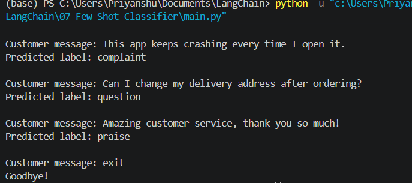

# 🧠 Few-Shot Intent Classifier using LangChain + Ollama

A simple NLP project demonstrating **Few-Shot Prompting** in LangChain.

Instead of training a machine learning model, the LLM learns from a few examples provided in the prompt and classifies customer messages into predefined categories.

---

## 📷 Demo

<p align="center">
    
</p>

---

## 🚀 Features

- Few-Shot Prompting
- LangChain Prompt Templates
- ChatOllama Integration
- Uses Llama 3.2 locally
- Interactive CLI
- Zero model training
- Easily extendable to more classes

---

## 🧠 Categories

The model classifies customer messages into:

- Complaint
- Question
- Praise

Example:

| Customer Message | Prediction |
|------------------|-----------|
| My refund hasn't arrived. | Complaint |
| What are your business hours? | Question |
| Excellent service! | Praise |

---

## 🛠 Tech Stack

- Python
- LangChain
- Ollama
- Llama 3.2
- Prompt Engineering

---

## 📂 Project Structure

```
07-Few-Shot-Classifier/
│
├── image/
│   └── output.png
│
├── main.py
├── requirements.txt
├── README.md
└── .gitignore
```

---

## ⚙️ Installation

Clone the repository

```bash
git clone https://github.com/yourusername/07-Few-Shot-Classifier.git

cd 07-Few-Shot-Classifier
```

Install dependencies

```bash
pip install -r requirements.txt
```

---

## 📦 Install Ollama

Download Ollama from

https://ollama.com/

Pull the model

```bash
ollama pull llama3.2
```

Start Ollama (if not already running)

```bash
ollama serve
```

---

## ▶️ Run

```bash
python main.py
```

Example

```
Customer message:
My order arrived damaged.

Predicted label:
complaint
```

---

## 💡 How Few-Shot Prompting Works

Instead of asking the LLM to classify directly, we first provide a few examples.

```
User:
My order arrived broken.

Assistant:
complaint

User:
What time do you close?

Assistant:
question

User:
Amazing quality!

Assistant:
praise
```

The LLM learns the pattern from these demonstrations and predicts the label for new messages.

---

## 📚 Concepts Used

- Few-Shot Prompting
- Prompt Templates
- ChatPromptTemplate
- FewShotChatMessagePromptTemplate
- Output Parsers
- Prompt Engineering
- Local LLMs with Ollama

---

## 🎯 Learning Outcomes

This project demonstrates:

- How Few-Shot Prompting improves LLM performance
- Building prompt pipelines with LangChain
- Running local LLMs
- Designing reusable prompt templates
- Intent classification without model training

---

## 📄 Requirements

```
langchain
langchain-core
langchain-community
langchain-ollama
```

---

## ⭐ Future Improvements

- Add more intent classes
- Streamlit Web UI
- FastAPI REST API
- Confidence scores
- Batch classification
- CSV file prediction
- LangSmith tracing
- Multi-language support

---

## 👨‍💻 Author

**Priyanshu Singh**

If you found this project useful, consider giving it a ⭐ on GitHub.